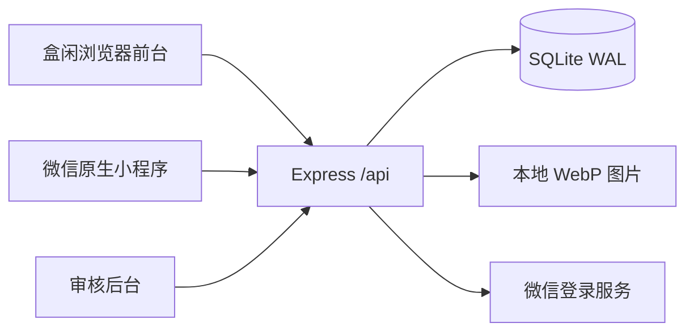

# 盒闲技术说明

更新日期：2026-09-17。本文以仓库实现为准，UI 依据用户提供的 `盒闲-手机版UI (3).html`（SHA-256：`821c810fad1bf8fd84ad5eeb4ae563ed01ed66c390dacc874ea2094b898958cc`）。本次迁移基线 `0aef8d4`。

## 架构与技术栈

| 层 | 当前实现 |
| --- | --- |
| 浏览器业务前台 | 原生 HTML、CSS、JavaScript；Hash 路由；Fetch 调用同源 REST API；无 React/Vue、无前端构建步骤 |
| UI | 盒闲移动优先布局；320–430px 手机，桌面最大 640px 居中；CSS 变量、SVG 图标、三张 5 秒轮播 |
| 微信客户端 | 原生 WXML / WXSS / JavaScript；基础库配置 3.7.12；自定义 tabBar、swiper、wx.request / wx.uploadFile |
| 服务端 | Node.js 24，Express 5.2.1，ES Modules |
| 数据库 | Node 内置 node:sqlite；SQLite WAL；单实例本地数据库 |
| 图片 | Multer 2.4.0 接收文件，Sharp 0.35.4 校验压缩为 WebP，本地持久化磁盘 |
| HTTP 防护 | Helmet 8.3.0，express-rate-limit 8.7.0，同源写请求校验 |
| 测试 | node:test、VM 小程序逻辑测试、Playwright 1.63.0，Windows 本机 Edge |
| 部署 | Docker Compose + Nginx HTTPS；ECS 模板已提供，未完成云端实机部署 |

版本取自 package-lock.json；安装用 npm ci。没有新增运行依赖，没有新增数据库迁移。



## 页面与真实数据映射

| UI 入口 | 浏览器 | 微信小程序 | 数据来源 |
| --- | --- | --- | --- |
| 首页与即时搜索 | #home、顶部搜索建议 | pages/home/home | GET /api/products，逐字查询；过期响应丢弃 |
| 商品详情 | #detail/:id，弹窗 | pages/detail/detail | GET /api/products/:id |
| 中央圆形闲置 | 发布/编辑弹窗 | pages/publish/publish | 上传、创建/更新商品 API |
| 我的 | #profile | pages/mine/mine | 登录状态与真实用户信息 |
| 我发布的 | #mine | 我的页面内展开列表 | GET /api/mine |
| 我想要的 / 我的收藏 | #favorites | pages/favorites/favorites | GET /api/favorites；两个入口指向同一真实收藏列表 |
| 失物 | #lost | pages/lost/lost | 明确显示尚未开放，无失物数据接口 |
| 消息 | #messages | pages/messages/messages | 明确显示聊天尚未开放；联系仍通过商品详情获取联系方式 |
| 审核 | /admin.html | 无 | /api/admin/* |

发布后进入待审核，仅卖家及管理员可查看。管理员通过后才出现在公开首页和搜索结果。编辑会重新审核。UI 原型中“发布即出现首页”的演示行为没有用于正式业务。

聊天、交易体验反馈、失物发布没有后台实现。本次没有新增这些接口，也没有模拟成功发送。无订单、在线付款、佣金或付费置顶。

## 文件职责

- web/index.html：新版业务页面结构、原型 SVG 插画、五个导航入口。
- web/app.js：API、登录、分类分页、即时搜索、轮播、详情、收藏、发布与状态更新。
- web/style.css：已有表单、商品和管理后台基础样式。
- web/heji-reference.css：参考 HTML 的视觉样式；web/heji.css：实际页面布局及兼容覆盖。
- web/demo.html：可离线打开的单文件静态 UI 原型，演示状态刷新清空，不代表真实业务服务。
- docs/prototypes/heji-mobile.html：可编辑原型源文件，与 demo.html 同步。
- miniprogram/custom-tab-bar/：四个微信 tab 页面加中央发布动作；发布仍为普通页面，支持编辑参数。
- miniprogram/assets/：从相同 SVG 图标生成的本地 PNG，不依赖外链。
- server/app.js / store.js：接口与表结构。本次 UI 迁移未更改现有业务接口。

## 数据与权限

| 表 | 用途 |
| --- | --- |
| users | 微信 openid 与显示名 |
| sessions | 令牌 SHA-256、身份与到期时间；不保存明文令牌 |
| media | 图片所有者、文件名与创建时间 |
| products | 发布者、商品字段、整数分价格、状态、审核说明 |
| product_media | 商品图片及排序 |
| favorites | 用户与商品唯一收藏关系 |
| reports | 举报、处理状态 |
| audit_log | 审核动作日志 |

所有写入从服务端校验。用户只能编辑自己的商品，关联图片必须属于本人。公开列表只显示 active；收藏中的失效商品返回有限摘要。价格以分存储、接口以两位小数字符串返回，不加手续费。用户会话 7 天，管理员会话 8 小时。

图片最多 6 张，每次上传一张，单张最多 8MB。客户端累计追加并支持删除；服务端独立校验。未公开图片只允许所有者、管理员或一小时内的签名 URL 访问，公开图片随商品状态控制访问。

## 运行、验证与部署

```powershell
npm ci
npm run dev
# http://127.0.0.1:3000，后端及界面都在该地址
npm run check
$env:PLAYWRIGHT_CHANNEL = 'msedge'
npm run test:e2e
```

开发服务强制监听 127.0.0.1；生产禁止 demo。生产浏览器没有普通用户登录能力，学生操作使用微信小程序；浏览器 demo 双账号只用于本机验收。微信 AppID/AppSecret 尚需运营者提供并进行开发者工具、真机及微信提审验证。

环境变量和云部署见 deployment.md，完整接口见 api.md。Git push 仅上传源码，不等于部署 ECS 或发布小程序。GitHub Pages 只能展示静态 demo，不能运行 Express/SQLite。
